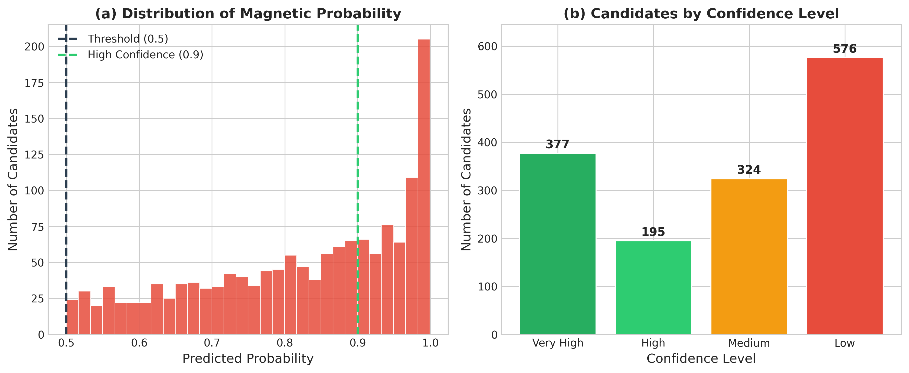
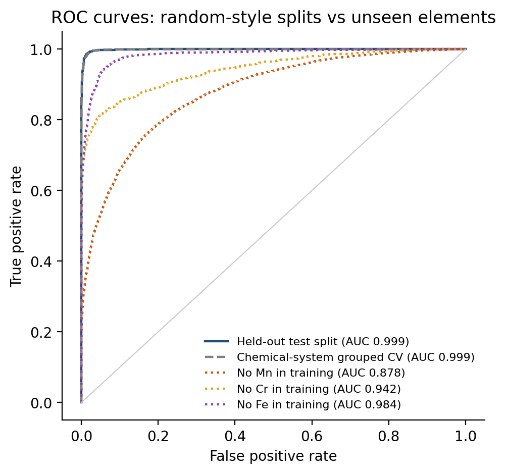
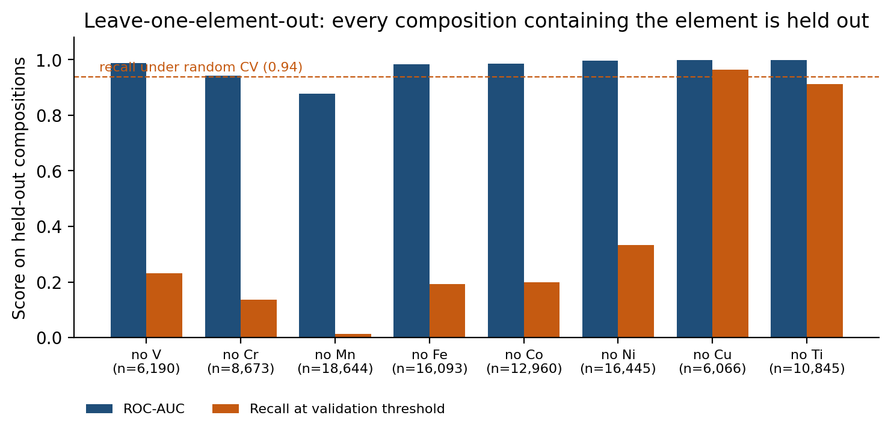
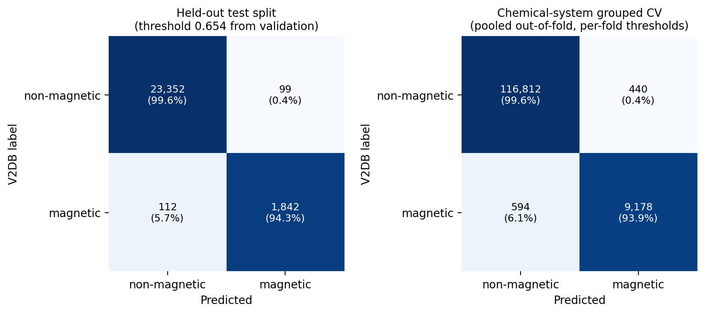
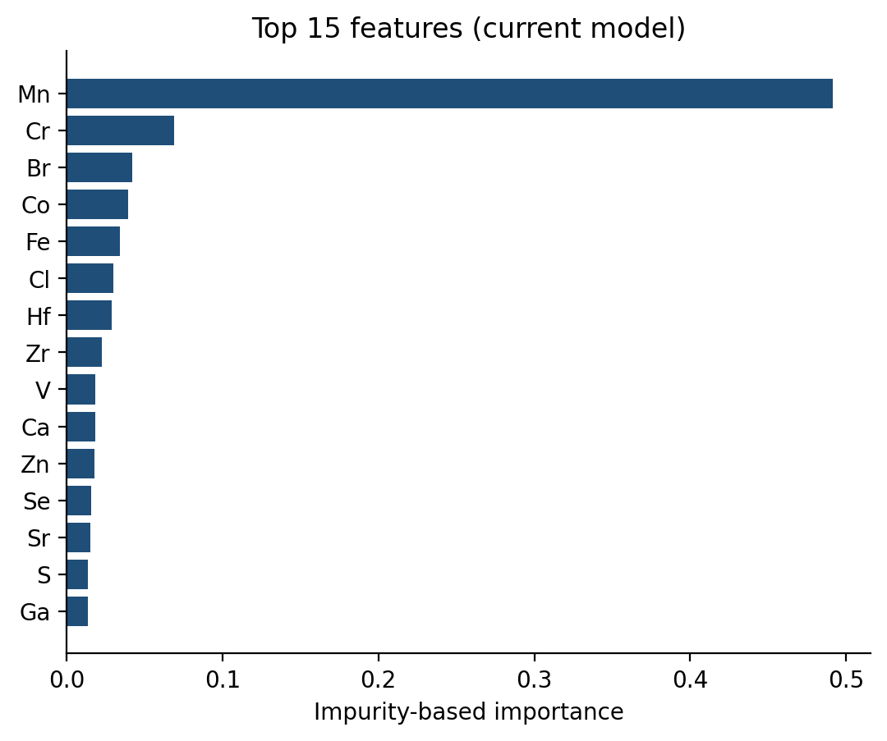

# Composition-only screening of magnetic 2D materials

[](https://github.com/eigen-ml/2d-magnetic-materials-ml/actions/workflows/tests.yml)

This is my undergraduate thesis at Ankara University (2026). I trained a gradient boosting classifier that predicts from the chemical formula alone whether a 2D material is magnetic. The model sees only the element fractions and the atom count of the reduced formula, not the crystal structure. I then used it to score made-up formulas that were not in the data. It is meant as a cheap first filter before DFT, not a replacement for it.

## Thesis result

| | |
| --- | --- |
| Data | 141,171 compositions from C2DB and V2DB, 14,601 magnetic |
| ROC-AUC (20% test split) | 0.986 |
| Recall | 0.906 |
| Precision | 0.756 |
| Candidates | 377 new formulas with a score of 0.95 or higher |
| Checked with DFT | None. The 377 are unverified candidates. |
| Version | tag [`thesis-2026`](../../tree/thesis-2026) |



## What the re-check shows

After the thesis I redid the work with stricter rules: V2DB only, a separate validation split for choosing the threshold, and two harder tests. 127,024 compositions remain after removing 2,231 formulas whose structures disagree on the label. The two harder tests are the main result.

**Leave one element out.** Every composition that contains the element is removed from training and used as the test set. For V, Cr, Mn, Fe, Co and Ni, recall drops to between 1% and 33%. The model does not flag magnetism that comes from an element it has not seen.

| Held-out element | Test compositions | Magnetic share | ROC-AUC | Recall | Precision |
| --- | --- | --- | --- | --- | --- |
| V | 6,190 | 15% | 0.987 | 0.231 | 1.000 |
| Cr | 8,673 | 18% | 0.942 | 0.137 | 1.000 |
| Mn | 18,644 | 41% | 0.878 | 0.014 | 1.000 |
| Fe | 16,093 | 10% | 0.984 | 0.192 | 1.000 |
| Co | 12,960 | 12% | 0.986 | 0.199 | 1.000 |
| Ni | 16,445 | 6% | 0.997 | 0.333 | 1.000 |
| Cu | 6,066 | 3% | 0.999 | 0.965 | 0.734 |
| Ti | 10,845 | 2% | 0.998 | 0.913 | 0.752 |

**Rule comparison.** The rule "contains V, Cr, Mn, Fe, Co or Ni" misses just 2 of the 9,772 magnetic compositions, but only 14% of what it flags is magnetic. The model finds 94% of them with 95% precision, so it learns more than "has a magnetic metal".

| Evaluation | ROC-AUC | Recall | Precision |
| --- | --- | --- | --- |
| Rule: "contains V, Cr, Mn, Fe, Co or Ni" | – | 1.000 | 0.137 |
| Model, test split (20%, threshold chosen on validation) | 0.999 | 0.943 | 0.949 |
| Model, 5-fold CV grouped by chemical system | 0.999 | 0.939 | 0.955 |

Why 0.999: the V2DB labels are themselves predictions of an ML model, so this model mostly learns to copy that model. It does not show that composition alone explains magnetism.

So the model is useful for ranking compositions made of elements it has seen, and not for new magnetic elements. The thesis and re-check numbers use different data and test setups, so they should not be compared directly.

## Details

### Thesis version

C2DB and V2DB merged into 141,171 compositions. 80/20 train/test split, decision threshold 0.5. F1 on the test split is 0.824 and accuracy 0.960.

Screening: 2,528 formulas generated from fixed element lists, 492 already in the data, 2,036 scored. 1,472 scored above 0.5 and 377 scored 0.95 or higher. None of them has been checked with DFT.

Model, data and results of this version are kept unchanged under `models/legacy_hybrid/`, `data/legacy_hybrid/` and `results/legacy/`.

### Notes on the re-check

Grouping the folds by chemical system hardly changes the result. V2DB has 76,925 distinct element sets and at least half of them contain a single composition, so this split ends up close to a random one.

Mn alone takes about half of the feature importance. Feature importance here is impurity based. It shows what the model uses, not a physical mechanism.

<p>
  
  
</p>
<p>
  
  
</p>

### Pipeline (re-check)

```text
V2DB CSV (formula, prototype, magnetic label)
  -> schema and label checks, reduce formulas with pymatgen
  -> drop formulas whose prototypes disagree on the label (2,231 removed)
  -> features: elemental fractions + reduced-formula atom count (52 features)
  -> stratified split 64 / 16 / 20 (train / validation / test)
  -> class-weighted GradientBoostingClassifier (scikit-learn)
  -> choose threshold on validation, evaluate once on test
  -> random, chemical-system grouped and leave-one-element-out CV
  -> score a small enumerated set of compositions not in V2DB
```

### Repository layout

```text
scripts/02_prepare_data.py        clean V2DB, build consensus labels
scripts/03_train_model.py         train, pick threshold, evaluate on test
scripts/04_discover.py            score enumerated compositions
scripts/05_grouped_validation.py  random / grouped / leave-element-out CV
figures/05_visualize.py           dataset and screening figures (fig1-fig5)
figures/06_evaluation_figures.py  ROC, confusion matrix, leave-element-out (eval_*)
api/main.py                       FastAPI service for the trained model
models/                           current model, threshold and metadata
results/                          CV summaries and screening outputs
tests/                            pytest suite (runs in CI)
*/legacy*                         artefacts of the thesis version
```

### Reproducing

Python 3.10+.

```bash
git clone https://github.com/eigen-ml/2d-magnetic-materials-ml.git
cd 2d-magnetic-materials-ml
python -m venv .venv && source .venv/bin/activate
pip install -r requirements.txt

python scripts/02_prepare_data.py        # ~10 s
python scripts/03_train_model.py         # ~30 s
python scripts/05_grouped_validation.py  # 18 model fits, ~1.5 min on 12 cores
python scripts/04_discover.py
python figures/05_visualize.py
python figures/06_evaluation_figures.py

python -m pytest -q
```

The committed `models/model.joblib` was trained with scikit-learn 1.7.2. joblib files are pickles, so only load models you trained yourself or trust.

### REST API

The trained model is served with FastAPI. The API loads the same files as `scripts/04_discover.py`.

```bash
docker compose up --build
curl -X POST localhost:8000/predict -H "Content-Type: application/json" \
     -d '{"formulas": ["CrI3", "MoS2"]}'
```

Endpoints: `GET /health`, `GET /model` (version, threshold, test metrics), `POST /predict` (up to 1000 formulas per request). Interactive docs at `http://localhost:8000/docs`. Formulas with elements outside the training set get an error instead of a score. Scores are uncalibrated model outputs, not probabilities that a real material is magnetic.

For a public HTTPS deployment (API behind Caddy) see [deploy/README.md](deploy/README.md).

<!-- Public demo URL goes here once it is deployed. -->

### Screening output (re-check)

`scripts/04_discover.py` builds 2,528 binary and ternary formulas from fixed element lists, removes the 212 that already exist in V2DB and scores the remaining 2,316. 432 pass the validation threshold (`results/candidate_shortlist.csv`). These are compositions to look at with a structure-aware method, not new materials. No crystal structure, stability or charge balance is checked.

### Limitations

- The target is the V2DB magnetic label, which is itself an ML prediction trained on C2DB data, not a DFT calculation done here.
- Composition-only features ignore structure, coordination, oxidation state, magnetic configuration and spin–orbit coupling.
- Removing formulas with conflicting labels across prototypes gives a cleaner target but narrows the question.
- Scores are not calibrated, and the model does not generalise to unseen magnetic elements.

### Data and license

Code is MIT licensed. The license does not cover V2DB or files derived from it; see [DATASET_NOTES.md](DATASET_NOTES.md) for provenance and checksums. V2DB is described by its authors as CC BY 4.0. If you use the data, cite:

- M. C. Sorkun, S. Astruc, J. M. V. A. Koelman, S. Er, *V2DB: Virtual 2D Materials Database*, Harvard Dataverse (2020), [doi:10.7910/DVN/SNCZF4](https://doi.org/10.7910/DVN/SNCZF4).
- M. C. Sorkun et al., "An artificial intelligence-aided virtual screening recipe for two-dimensional materials discovery", *npj Computational Materials* 6, 106 (2020), [doi:10.1038/s41524-020-00375-7](https://doi.org/10.1038/s41524-020-00375-7).

## Contact

Ata Berk Öztürk · ataberkozturk5a@gmail.com
