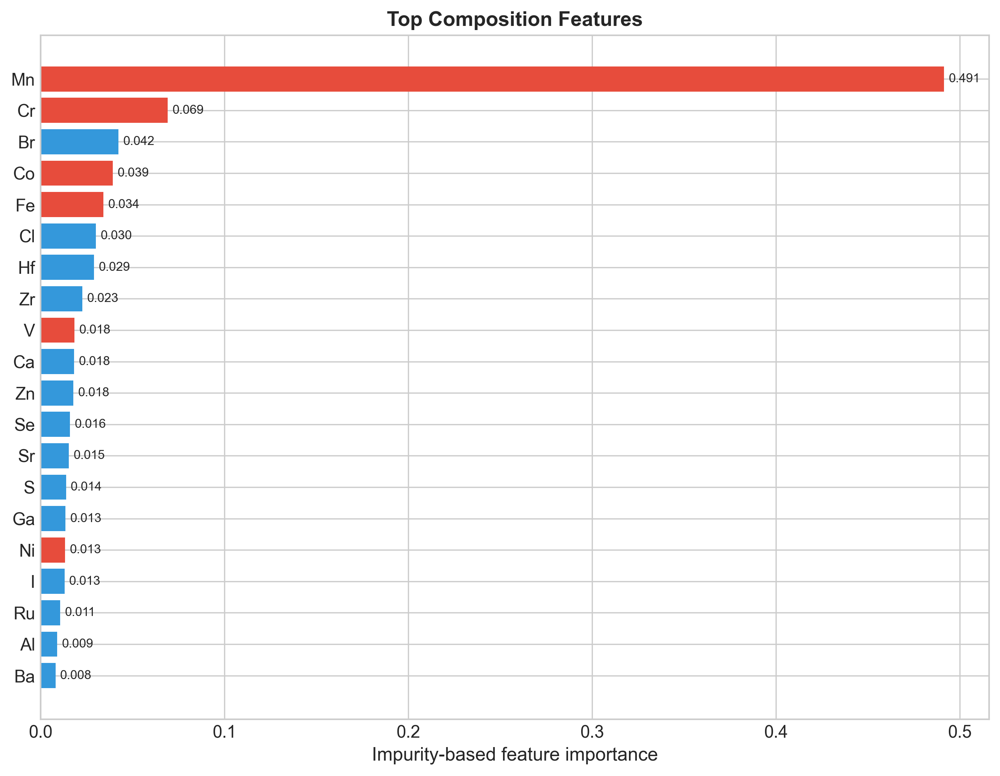
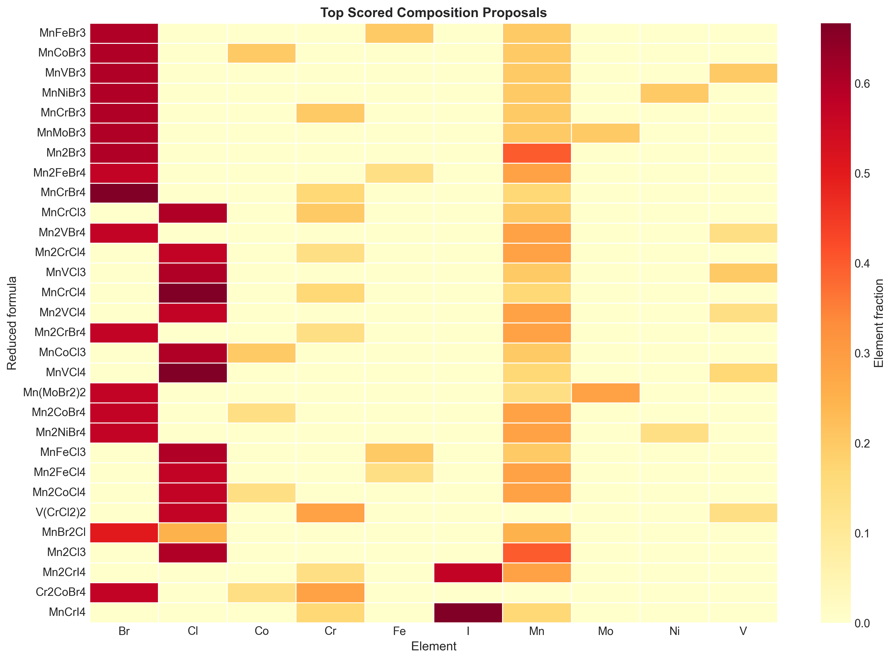

# Composition-Only Screening of Magnetic Ordering in 2D-Material Candidate Space

This research portfolio project studies whether reduced chemical composition alone can classify the binary magnetic label attached to entries in the Virtual 2D Materials Database (V2DB), then applies that classifier to a small, rule-enumerated composition space. It is a screening and methodology project: its outputs are model-ranked composition proposals, not newly discovered materials, stable crystal structures, or experimentally/DFT-validated magnetic phases.

> Upstream data note: The [Virtual 2D Materials Database (V2DB)](https://dataverse.harvard.edu/dataset.xhtml?persistentId=doi:10.7910/DVN/SNCZF4) project describes its dataset as CC BY 4.0. The exact provenance and checksum of the checked-in CSV were not recorded, so verify the dataset record and file-level terms before redistribution; the repository's MIT license does not relicense upstream data.

## Scientific motivation

Magnetic monolayers are interesting for spintronics, sensing, and low-dimensional condensed-matter physics, but high-fidelity structural calculations are expensive. A composition-only model is computationally cheap and can be useful as an early triage stage. The scientific question here is deliberately narrow: how much of a database magnetic label can be recovered from elemental fractions and reduced-formula atom count, and which enumerated compositions should be examined by a structure-aware workflow next?

## Pipeline

```text
V2DB CSV (formula, prototype, upstream magnetic label)
    -> schema and label validation
    -> reduced-formula normalization
    -> remove formulas with conflicting prototype-level labels
    -> elemental fractions + reduced-formula atom count
    -> stratified train / validation / test split (64 / 16 / 20)
    -> class-weighted Gradient Boosting classifier
    -> choose operating threshold on validation data
    -> report metrics once on the untouched test split
    -> enumerate a documented composition search space
    -> exclude formulas in the supplied reference set
    -> rank by uncalibrated model score
    -> structure assignment, stability calculations, and magnetic validation (not implemented)
```

## Key technologies

- Python 3.10+
- pandas and NumPy for data handling
- pymatgen for formula parsing and reduction
- scikit-learn for splitting, Gradient Boosting, and evaluation
- joblib for local model persistence
- Matplotlib and seaborn for figures
- pytest and GitHub Actions for lightweight verification

## Installation

```bash
git clone https://github.com/eigen-ml/2d-magnetic-materials-ml.git
cd 2d-magnetic-materials-ml
python -m venv .venv
source .venv/bin/activate          # Linux/macOS
# .venv\Scripts\activate          # Windows PowerShell
python -m pip install --upgrade pip
python -m pip install -r requirements.txt
```

The code uses only open-source Python packages. No proprietary electronic-structure software is required for data preparation, model training, screening, or tests.

## Reproducible quick start

The repository snapshot includes `data/v2db.csv`. Its 316,505 rows and schema agree with the published V2DB description, but the exact local file provenance was not recorded in Git; see [Dataset and artefact notes](DATASET_NOTES.md) before redistribution.

```bash
# 1. Validate V2DB, reduce formulas, and build consensus composition labels.
python scripts/02_prepare_data.py

# 2. Train; select the threshold on validation data; evaluate on held-out test data.
python scripts/03_train_model.py

# 3. Score rule-enumerated compositions absent from the generated reference list.
python scripts/04_discover.py

# 4. Optional: generate figures from the new, current-pipeline artefacts.
python figures/05_visualize.py
```

These commands overwrite generated files in `data/`, `models/`, `results/`, and `figures/`. Model training is intentionally excluded from continuous integration because it is not a lightweight test.

Run the inexpensive verification suite with:

```bash
python -m pytest -q
```

All three pipeline scripts accept `--help`. Paths are resolved from the repository rather than the shell's current directory, and missing inputs produce a non-zero exit code with an actionable error.

## Project structure

```text
.
├── .github/workflows/tests.yml       # Python test workflow
├── data/
│   ├── v2db.csv                      # Third-party V2DB snapshot
│   ├── combined_dataset.csv          # Tracked legacy hybrid output; regenerated by step 1
│   └── known_materials.txt           # Tracked legacy reference set; regenerated by step 1
├── figures/
│   ├── 05_visualize.py               # Current artefact-driven plotting script
│   └── fig*.png                      # Existing legacy hybrid-run figures
├── models/                           # Existing legacy model and metadata; regenerated by step 2
├── results/                          # Existing legacy outputs; current step 3 writes new filenames
├── scripts/
│   ├── 02_prepare_data.py
│   ├── 03_train_model.py
│   └── 04_discover.py
├── tests/                             # Dataset-free unit and failure-mode tests
├── DATASET_NOTES.md
├── LICENSE
└── requirements.txt
```

The repository has no `01_*.py` script or `utils.py`; earlier README references to those nonexistent files have been removed.

## Methodology

### Labels and preprocessing

`Material_is_magnetic` is an upstream V2DB label, not a new DFT calculation performed by this repository. Formulas are reduced with `pymatgen.core.Composition`. Because V2DB can contain multiple structural prototypes for the same reduced formula, the current preparation step drops any formula whose prototype rows disagree on the binary label. This avoids resolving a structure-dependent conflict by arbitrary row order.

An audited preparation run on the checked-in `v2db.csv` read 316,505 rows, found no invalid formulas, removed 2,231 reduced formulas with conflicting prototype-level labels, and retained 127,024 consensus compositions; 9,772 (7.7%) carry the magnetic label. These are preprocessing counts, not model-performance results.

### Features and model

Each composition is represented by one elemental-fraction feature per observed element plus `natoms`, the atom count of the reduced formula. The classifier is `GradientBoostingClassifier` with a fixed random seed. A moderate magnetic-class sample weight addresses class imbalance; the exact fitted parameters, feature order, direct dependency versions, split sizes, input SHA-256, threshold-selection outcome, and test metrics are written to `models/metadata.json`.

The split is stratified into training, validation, and test partitions. Model fitting uses only the training partition, operating-threshold selection uses only validation data, and the reported metrics use the test partition once.

### Screening

The screening script enumerates binary, ternary, mixed-metal, and mixed-anion formulas from explicit element lists in `scripts/04_discover.py`. It normalizes and deduplicates them, removes formulas present in `known_materials.txt`, and scores the remainder using the saved feature schema. The output score bands are descriptive ranges, not calibrated confidence intervals.

Current screening outputs are:

- `results/screened_candidates.csv`
- `results/candidate_shortlist.csv`
- `results/screening_summary.json`

The shortlist intentionally does not prescribe `PBE+U`: a defensible DFT setup requires a proposed structure, oxidation-state reasoning, convergence tests, and system-specific treatment choices.

## Results and audited legacy artefacts

The checked-in model/results/PNG/XLSX artefacts came from an older C2DB+V2DB hybrid pipeline, not from the current V2DB-only scripts. Their metadata records 141,171 reduced compositions (13,251 C2DB and 127,920 V2DB), ROC-AUC 0.986260, precision 0.755784, recall 0.906164, and F1 0.824171. The old code selected its threshold and evaluated metrics on the same holdout split, so these numbers are historical exploratory results and should not be presented as an independent final evaluation. They have not been silently relabelled as current results.

The legacy screening files contain 1,472 formulas above a 0.5 threshold, including 377 with scores at least 0.95. These are unvalidated composition proposals absent from the old local reference list. “Absent from that list” does not establish global novelty, synthesizability, two-dimensional stability, a crystal structure, or magnetic ground state.

Two useful existing figures are retained below as transparent records of that legacy run; regenerate them after running the current pipeline before using them in an application or report.



*Legacy hybrid-run impurity-based feature importance. Importance is predictive association within that model, not evidence of a microscopic magnetic mechanism.*



*Legacy hybrid-run top-score composition heatmap. It visualizes the deliberately constrained enumeration space, not experimentally or computationally validated compounds.*

`fig1_dataset_overview.png` and `fig5_pipeline_summary.png` also describe the old hybrid dataset and are not embedded as current evidence. `results/thesis_tables.xlsx` is a manually assembled legacy workbook and is not generated by the present scripts.

## Limitations

- V2DB's magnetic labels are upstream ML predictions derived from a workflow trained on C2DB data; this project is therefore learning those labels, not replacing direct magnetic DFT calculations.
- Composition-only features discard prototype, coordination, dimensionality, oxidation state, lattice geometry, magnetic configuration, spin-orbit coupling, and exchange interactions.
- Dropping prototype-discordant formulas yields a cleaner composition target but narrows the scientific question and may bias the retained set.
- A random stratified split estimates interpolation within this dataset. It does not measure leave-element-out, leave-chemistry-out, temporal, or external-database generalization.
- The classifier scores are not probability-calibrated, and no uncertainty intervals or repeated cross-validation results are reported.
- Candidate enumeration does not enforce charge neutrality, structural feasibility, thermodynamic/dynamic stability, toxicity, abundance, or synthesizability.
- Feature importance cannot establish causality or a physical mechanism.
- joblib files use pickle-based deserialization. Load only model artefacts you created or trust.

## Dataset and licensing notes

The MIT license in this repository covers original code and documentation only. It does not relicense V2DB, C2DB, derived datasets, saved models, result tables, or figures that may be subject to upstream terms. See [DATASET_NOTES.md](DATASET_NOTES.md) for file-level provenance, checksums, citations, and unresolved points.

If using V2DB, cite the dataset and the associated paper:

- M. C. Sorkun, S. Astruc, J. M. V. A. Koelman, and S. Er, *V2DB: Virtual 2D Materials Database*, Harvard Dataverse (2020), [doi:10.7910/DVN/SNCZF4](https://doi.org/10.7910/DVN/SNCZF4).
- M. C. Sorkun et al., “An artificial intelligence-aided virtual screening recipe for two-dimensional materials discovery,” *npj Computational Materials* 6, 106 (2020), [doi:10.1038/s41524-020-00375-7](https://doi.org/10.1038/s41524-020-00375-7).

## Future work

- Add group-aware or chemistry-held-out validation and repeated uncertainty estimates.
- Calibrate scores on a strictly separate calibration set.
- Compare composition baselines with structure-aware descriptors.
- Assign plausible prototypes before any DFT shortlist is claimed.
- Add charge-neutrality and stability filters with documented physical assumptions.
- Validate selected candidates using converged, reproducible spin-polarized calculations and report negative results as well as positive ones.
- Publish a versioned release and archive regenerated artefacts with checksums.

## Citation and contact

There is currently no DOI or peer-reviewed publication for this repository. Until a versioned archive exists, cite the repository URL together with the exact commit hash and access date; do not cite the placeholder 2025 manuscript entry from the former README as a publication.

Author: Ata Berk Öztürk<br>
Contact: ataberkozturk5a@gmail.com

## REST API and Docker

The trained classifier is also served over HTTP with FastAPI.

```bash
docker compose up --build
curl -X POST localhost:8000/predict -H "Content-Type: application/json" \
     -d '{"formulas": ["CrI3", "Fe2O3"]}'
```

Endpoints: `GET /health`, `GET /model` (version, threshold, test metrics), `POST /predict` (up to 1000 formulas). Interactive docs are at `http://localhost:8000/docs`. Scores are uncalibrated model outputs, not probabilities of a real magnetic phase.
